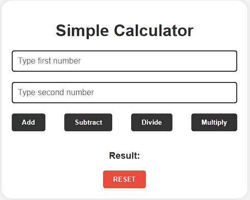

# Simple Calculator

A very simple calculator built with HTML, CSS and Javascript

## Project Description
This project is a basic calculator that performs simple arithmetic operations like addition, subtraction, multiplication, and division. The calculator interface is built using plain HTML and CSS, while the functionality is powered by JavaScript.

## Features
* Basic arithmetic operations: addition, subtraction, multiplication, division.
* Responsive design for different screen sizes.
* Clear button to reset the calculator.
* A simple and clean user interface.

### Installation
To run this project locally, simply clone the repository and open the index.html file in your web browser.

```bash
git clone https://github.com/Adlichalbi/Simple_Calculator.git
cd simple-calculator
open index.html
```

### Usage
1. Enter the numbers into the corresponding input fields.
2. Choose the desired arithmetic operation (e.g., +, -, *, /).
3. Use the RESET button to clear the screen.

### Technologies Used
* HTML: For the structure of the calculator.
* CSS: For styling the user interface.
* JavaScript: For implementing the calculator's logic.

### Screenshots


### License
This project is open source and available under the MIT License.

### Contact
If you have any questions or suggestions, feel free to reach out.

